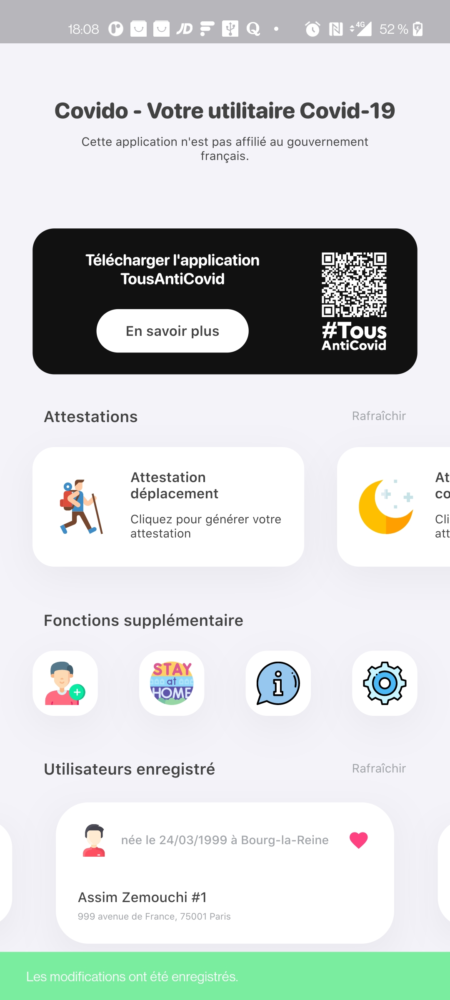

# covido_app

Covido app is my very first application developed in Dart, designed for IOS and Android allowing to generate its output certificate in a single click.

Application developed during the first containment, did not succeed in order to promote the [TousAntiCovid](https://bonjour.tousanticovid.gouv.fr/) application highlighted on the application.

The application is voluntarily functional only on certain points so that users favor the use of [TousAntiCovid](https://bonjour.tousanticovid.gouv.fr/) rather than Covido.

Note: Pdf's are created beautifully and well, they are directly stored in the download folder of your phone.

## Getting Started

This project is a starting point for a Flutter application.

A few resources to get you started if this is your first Flutter project:

- [Lab: Write your first Flutter app](https://flutter.dev/docs/get-started/codelab)
- [Cookbook: Useful Flutter samples](https://flutter.dev/docs/cookbook)

For help getting started with Flutter, view our
[online documentation](https://flutter.dev/docs), which offers tutorials,
samples, guidance on mobile development, and a full API reference.
